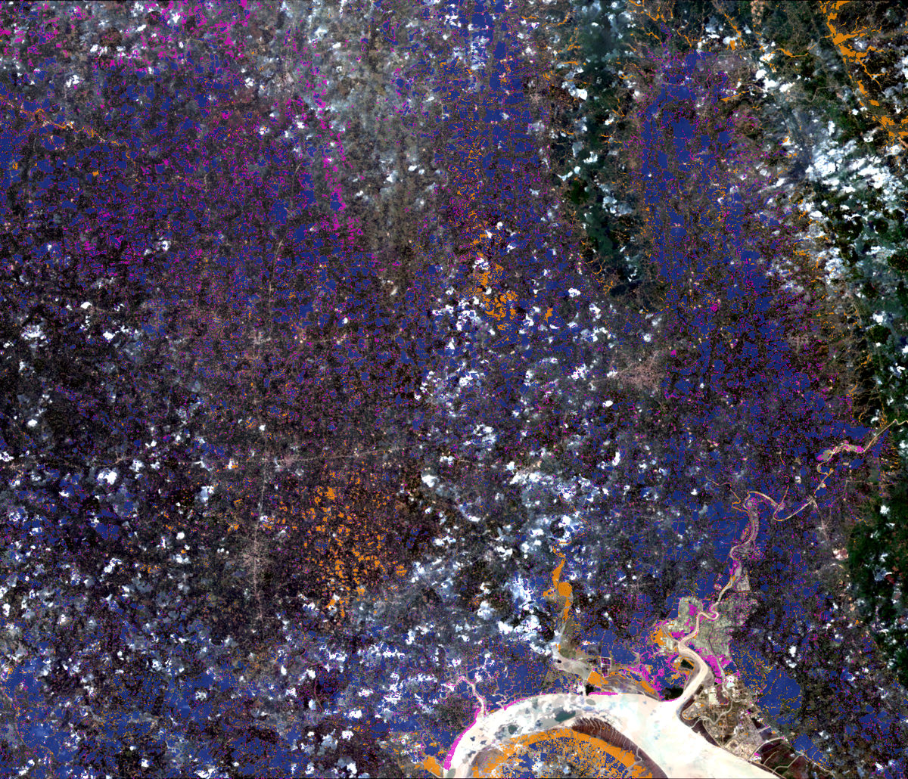

# DisasterShield-X

**SAR flood-extent mapping validated against independent UN ground truth.**
August 2024 Feni/Noakhali flood, Bangladesh — 10 m Sentinel-1.

The model maps flood extent from Sentinel-1 radar change detection and is scored
against the UNOSAT flood product, which is derived independently of the model's
inputs (radar + human analysts). Numbers on this page are quoted verbatim from
frozen files under [`results/`](results/); the source path is linked or given in an
HTML comment next to each figure.

## Live demo

**[Interactive map →](https://isithm.github.io/DisasterShield/demo/index.html)**
(GitHub Pages; served from [`demo/index.html`](demo/index.html))



*Sentinel-2 (May 2024) base with the model-vs-UNOSAT agreement layer:
**dark blue** = both say flooded, **orange** = model only, **magenta** = UNOSAT only.*

## Results

<!-- all numbers verbatim from results/20260703T165223Z/threshold_fair_v3.csv -->

| Model | Test IoU | Test F1 |
|---|---|---|
| **U-Net — S1 change detection** | **0.7216** | **0.8383** |
| Logistic regression (4-channel dB) | 0.6128 | 0.7599 |
| VV change threshold | 0.5724 | 0.7281 |
| VV absolute threshold | 0.5518 | 0.7111 |

Metric = **global pooled pixel-level water-class IoU / F1** on the spatially
held-out **east** test strip: one confusion matrix over all test pixels, with the
decision threshold tuned on the **validation** strip only and then evaluated once on
test. This single pooled definition is the canonical one — a per-image *mean* of
IoUs is not comparable across models (it was an earlier such mismatch that made the
logistic-regression baseline look competitive; see the report).

Frozen sources: [threshold_fair_v3.csv](results/20260703T165223Z/threshold_fair_v3.csv)
· [baseline_comparison.csv](results/20260703T052548Z/baseline_comparison.csv).

## Method

- **Input:** Sentinel-1 SAR change detection — VV + VH backscatter (dB) from the flood
  window (Aug 18–26 2024) and a pre-flood reference (May 2024): 4 channels at 10 m.
- **Model:** 2-class U-Net on 64×64 patches, Dice + water-weighted cross-entropy, seed 42.
- **Split:** geographic **west / mid / east** by longitude → train / val / test, so the
  test strip is spatially disjoint from training (no patch overlap across the boundary).
- **Labels:** UNOSAT `FL20240825BGD` flood extent (layer `S1_20240818_20240826`,
  Sentinel-1 + analyst derived), rasterized to the shared grid — independent of the inputs.

## What this is and isn't

**Is:** a single-event, spatially cross-validated benchmark of SAR change detection
against an independent UN product, under a fair protocol (one pooled metric, decision
threshold tuned on validation only).

**Isn't / caveats — stated plainly:**

- **Single-event model.** One flood, one region. Cross-event generalization is not yet
  demonstrated (see Roadmap).
- **The area headline is largely in-sample.** Predicted flooded area **915.0 km²** vs
  UNOSAT **905.5 km²** <!-- 915.0: results/20260703T202117Z/demo_build/build_manifest.json ; 905.53: reports/PHASE_2_REPORT.md Step 1d (UNOSAT vector) --> is computed over the
  *whole* scene, most of which is the training region; only the east strip is held out.
  Treat it as a sanity check, not a generalization result.
- **Residual false positives are SAR ambiguity, not label error.** The worst false
  positives were triangulated against two independent checks — the pre-flood
  permanent-water proxy and the later UNOSAT recession layer — and matched **neither**
  (0.000 overlap with both). They are soil-moisture / change-detection ambiguity on
  newly-darkened land. See
  [PHASE_2_REPORT.md → permanent-water & recession diagnostics](reports/PHASE_2_REPORT.md).
- **v1 is a deprecated negative result.** The earlier 500 m pipeline learned a
  *circular* label (the "ground truth" was essentially an NDWI threshold of an input
  band, so a trivial baseline scored ~0.999 IoU). It is retained only as documentation
  ([models/flood_model_2019_2023.ipynb](models/flood_model_2019_2023.ipynb)); its data
  artifacts were purged from git history.
- **The physics-informed ablation was refuted.** Adding explicit raw-dB change channels
  (v3) did not beat the 4-channel model on test and did not reduce the false-positive
  count (14 vs 14) — kept in the record rather than hidden.

## Repository

```
scripts/     pipeline: step2 (labels) → step3 (patches) → train_feni → baselines_feni
             → step5d (fair eval) → build_demo; plus permwater / recession diagnostics
reports/     PHASE_2_REPORT.md  — full audit trail (every number → a frozen file)
             REPO_CLEANUP.md    — what this cleanup commit did
results/      frozen run outputs (metrics.json, *.csv, diagnostics, final model .keras)
demo/         self-contained index.html (interactive Folium map)
docs/         README preview image
```

Large inputs (S1/S2 GeoTIFFs, UNOSAT shapefiles, `.npy` patch arrays) and every model
checkpoint except the single release artifact
([`results/20260703T054304Z/feni_unet_best.keras`](results/20260703T054304Z/feni_unet_best.keras))
are git-ignored; their provenance is documented below.

## Reproduction

1. **Environment:** Python 3.12, then `pip install -r requirements.txt` (CPU TensorFlow).
2. **Data provenance (not committed):**
   - Sentinel-1 GRD & Sentinel-2 SR exported via Google Earth Engine to 10 m EPSG:4326
     (`data/Feni_2024_10m/`); the GEE export approach is in
     [`data/Data_script_19_23/`](data/Data_script_19_23/).
   - UNOSAT flood shapefiles `FL20240825BGD` (`data/labels_unosat/`), from the UNOSAT /
     UNITAR emergency mapping portal.
3. **Pipeline (from `scripts/`):**
   `step2_rasterize_label.py` → `step3_make_patches.py --tag v2`
   → `train_feni.py --epochs 60 --tag v2` → `baselines_feni.py`
   → `step5d_threshold_fair.py` → `build_demo.py`.
   Diagnostics: `permwater_diagnostic.py`, `recession_crosscheck.py`.

Seeds are 42 throughout; each run freezes to `results/<UTC-timestamp>/`.

## Roadmap

Multi-event generalization (Sen1Floods11) in progress; a workshop paper is in preparation.

## License

MIT — see [LICENSE](LICENSE).
